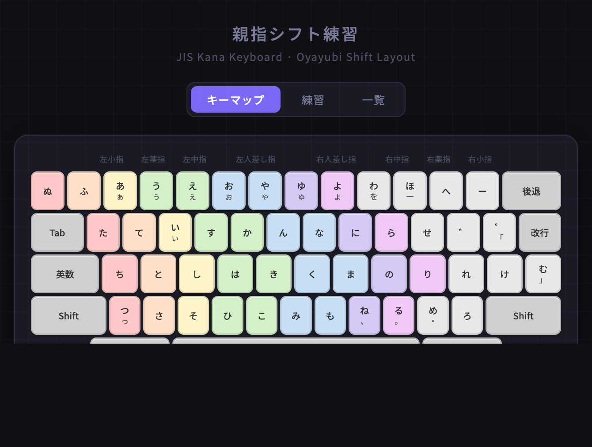

# jis-keyboard-practice

Language: [日本語](#japanese) | [English](#english)

React と Vite で作った JIS かなキーボード練習アプリです。親指シフト系の JIS かな配列を学ぶために、キーマップ表示、ガイド付き練習、かな一覧をまとめています。

A JIS kana keyboard practice app built with React and Vite. It provides a visual keyboard map, guided typing practice, and a kana reference view for learning an Oyayubi Shift style layout.

## Screenshot



<a id="japanese"></a>

## 日本語

### 主な機能

- 物理キーボード入力に反応するインタラクティブなキーマップ
- 練習画面で次に打つキーをキーボード上にハイライト表示
- 実際のキー入力で更新される、読み取り専用の入力表示欄
- 練習画面での Backspace / Delete による入力表示の修正
- 収録かなを確認できる一覧タブ
- 4 つの練習モード
	- `通常`: シフトなしのかなをランダム出題
	- `通常+シフト`: 通常かなとシフトかなをランダム出題
	- `五十音順`: 五十音順で固定出題
	- `単語`: 短い単語やフレーズを出題

### 画面構成

- `キーマップ`: JIS かな配列を表示し、押したキーをハイライトします
- `練習`: スコア、正確率、連続正解数、次キーのヒント付きで練習できます
- `一覧`: 練習対象のかなを一覧表示します

### 技術スタック

- React 18
- Vite 5

### 使い方

#### 動作要件

- Node.js 18 以上
- npm

#### インストール

```bash
npm install
```

#### 開発サーバー起動

```bash
npm run dev
```

Vite でローカル起動します。設定されている base path は `/jis-keyboard-practice/` です。

#### 本番ビルド

```bash
npm run build
```

#### ビルド結果のプレビュー

```bash
npm run preview
```

### ディレクトリ構成

```text
src/
	components/
		Keyboard.jsx
		ModeToggle.jsx
		PracticePanel.jsx
		PromptDisplay.jsx
		ReferenceGrid.jsx
		StatsRow.jsx
	data/
		layout.js
	hooks/
		usePractice.js
		useReactiveKeyboard.js
	App.jsx
	main.jsx
	styles.css
```

### キーボード動作

- キーマップと練習画面のキーボードは `KeyboardEvent.code` を使って物理キー入力に反応します
- 最上段のキー対応は JIS キーボード位置に合わせて調整しています
- キー配列マッピングは **MacBook** の JIS キーボードレイアウトを前提にしています
- 練習用の入力欄は UI 上に表示されますが、テキストボックス自体は直接編集できません
- 練習モードではグローバルなキー入力を受け取り、表示欄へ反映します

### 補足

- このプロジェクトはローマ字入力練習ではなく、JIS かな配列の学習を前提にしています
- 表示している配列や問題文は、IME 設定用ではなく練習と参照用です

<a id="english"></a>

## English

### Features

- Interactive keyboard map that reacts to physical key presses
- Practice screen with live target highlighting on the keyboard
- Read-only practice input display driven by actual keyboard input
- Backspace and Delete support for correcting visible input on the practice screen
- Kana reference tab for browsing available characters
- Four practice modes
	- `通常`: random non-shift kana
	- `通常+シフト`: random normal and shift kana
	- `五十音順`: fixed gojuon order practice
	- `単語`: simple word and phrase prompts

### Screens

- `キーマップ`: shows the JIS kana layout and highlights the pressed key
- `練習`: guided typing practice with score, accuracy, streak, and next-key hint
- `一覧`: reference grid of kana available in the practice layout

### Tech Stack

- React 18
- Vite 5

### Getting Started

#### Requirements

- Node.js 18 or later
- npm

#### Install

```bash
npm install
```

#### Run the development server

```bash
npm run dev
```

Vite serves the app locally. The configured base path is `/jis-keyboard-practice/`.

#### Build for production

```bash
npm run build
```

#### Preview the production build

```bash
npm run preview
```

### Project Structure

```text
src/
	components/
		Keyboard.jsx
		ModeToggle.jsx
		PracticePanel.jsx
		PromptDisplay.jsx
		ReferenceGrid.jsx
		StatsRow.jsx
	data/
		layout.js
	hooks/
		usePractice.js
		useReactiveKeyboard.js
	App.jsx
	main.jsx
	styles.css
```

### Keyboard Behavior

- The key map and practice keyboard react to physical key presses using `KeyboardEvent.code`
- The top-row mapping is aligned for JIS keyboard positions
- Key mapping is designed for the **MacBook** JIS keyboard layout
- Practice input is displayed in the UI but is not directly editable in the text field
- Printable input is captured globally for practice mode and reflected in the display box

### Notes

- This project is designed around a JIS kana input layout, not a romaji learning flow
- The visual layout and prompts are intended for practice and reference, not IME configuration
